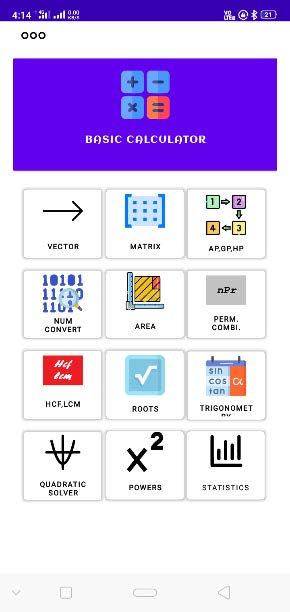
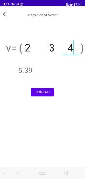
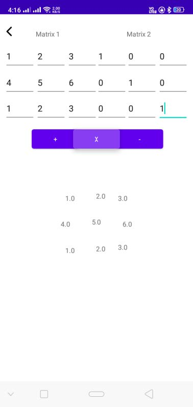
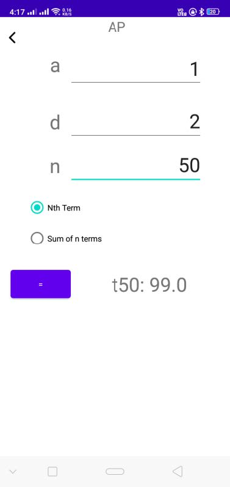
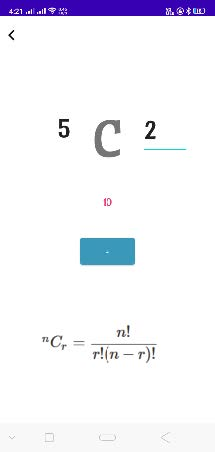
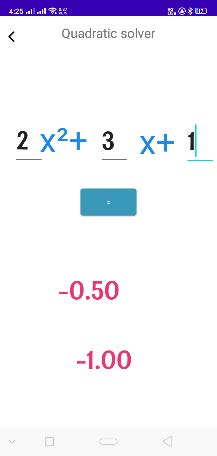

# Maths Solver

A native, high-performance Android utility built entirely in Java to execute formulaic math calculations, advanced matrix transformations, and multi-base number system conversions. 

This project demonstrates a strong foundation in native Android components, algorithmic layout designs, and memory-efficient matrix processing.

---

##  Features

###  Geometric & Formulaic Solvers
* Computes surface areas, volumes, and standard mathematical metrics for complex 3D shapes (Cubes, Cylinders, Spheres, etc.).
* Implements direct mathematical equations with input optimization to prevent standard arithmetic edge-case crashes (like division by zero).

###  Radix / Number System Converter
* Handles robust, multi-directional base conversions.
* Dynamically translates values across **Binary, Octal, Decimal, and Hexadecimal** configurations.

###  Matrix Arithmetic Engine
* Custom implementation of grid-based arithmetic operations.
* Supports **Matrix Addition, Subtraction, and Matrix Multiplication** with dimension-validation checks prior to calculation loops.

---

##  Tech Stack & Architecture

* **Language:** 100% Native Java
* **UI Framework:** Android XML Layouts (optimized with `ConstraintLayout` to reduce view hierarchy depth)
* **Build System:** Gradle
* **Execution Paradigm:** Pure Object-Oriented Programming (OOP) with encapsulated computational helper modules, ensuring clean separation between UI controllers and the underlying math engines.

---

##  Technical Highlights

* **Logic-First Implementation:** Built without relying on bloated, heavy third-party mathematical abstractions. All algorithms—including matrix cross-multiplication loops and number base shifts—are implemented via native Java primitives and structures.
* **Input Validation:** Strict parsing logic ensuring string inputs from text fields safely map to numerical matrices or geometric variables without causing runtime memory overhead or UI freezing.
* **Offline Execution:** Zero external network dependencies, ensuring lightning-fast performance and full local privacy.

---

## Application Demo

| | | |
| :---: | :---: | :---: |
|  |  |  |
|  |  |  |

## How to Run & Install

### For Users / Reviewers
You can download the production-ready compiled application directly from the **[Releases](../../releases)** tab of this repository. Sideload the `.apk` on any standard Android device.

### For Developers
To explore or modify the source code locally:
1. Clone this repository:
```bash
   git clone [https://github.com/ayushvaish234/maths_solver.git](https://github.com/ayushvaish234/maths_solver.git)
